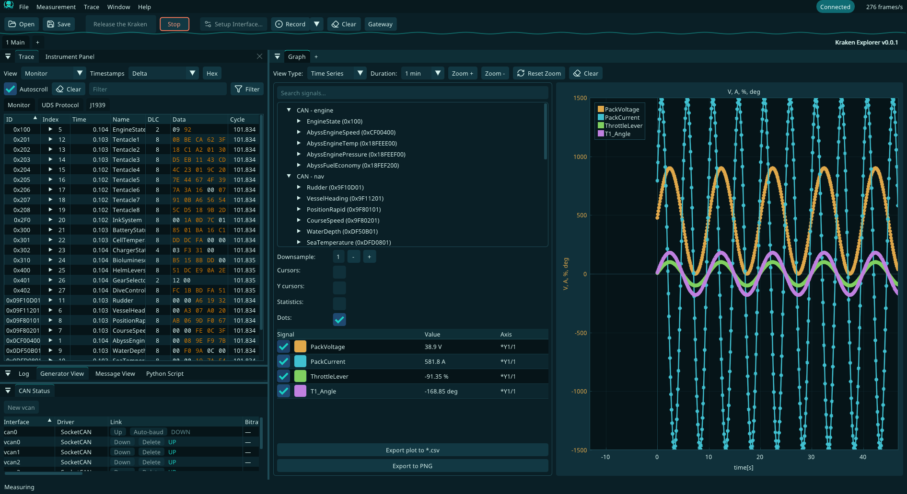

#  Kraken Explorer: Day of the N2K Tentacle
_"Deeper than a Peak. Wireshark is stuck in shallow waters."_

**Open-source CAN / CAN FD / LIN / NMEA 2000 bus analyzer for Linux 🐧**

Version 0.0.1.

**vs PCAN-Explorer:** the everyday PCAN-Explorer workflow (`.sym` symbol files, instrument panels, signal-based and triggered transmit, XY plots, cycle-time statistics), free, on Linux, with the adapters below.

**🔩 Supported Interfaces & Hardware:**

| Interface | Notes |
| :--- | :--- |
| **SocketCAN** | Any kernel CAN interface (`can0`, `vcan0`, …) |
| **PEAK PCAN** | PCAN-USB, PCAN-USB Pro, PCAN-PCIe, … through SocketCAN (`peak_usb` / `peak_pci` kernel drivers) |
| **Kvaser** | USB/CAN Leaf and other Kvaser devices via CANlib SDK (`-DKRAKEN_KVASER=ON`) |
| **Candlelight / CANable / CANnectivity** | gs_usb devices (CANable with Candlelight firmware, MKS CANable, cantact, CANnectivity, …). Via SocketCAN (`gs_usb` kernel driver) |
| **SLCAN** | CANable (SLCAN firmware), WeAct, Arduino CAN shields |
| **CANblaster** | UDP-based remote CAN via [CANblaster](https://github.com/OpenAutoDiagLabs/CANblaster) (enable in Measurement > Driver menu) |
| **GrIP** | GrIP protocol (CAN, CAN FD, LIN, GPIO) |
| **lin_usb (LindeAPI)** | USB LIN adapter (VID `0x1d50` / PID `0x606f`). Multi-channel. Master, slave, and monitor modes. Hardware LIN scheduling via LDF. |
| **aio_usb (aiode)** | Digital I/O and analog inputs on the same USB adapter (VID `0x1d50` / PID `0x606f`), controlled from the GPIO Control window |

## ⚙️ Features

*   **Real-time CAN/CAN-FD/LIN Decoding**: Standard CAN, CAN FD and LIN frames, with UDS and J1939 protocol views in the trace.
*   **DBC, SYM & LDF Database Support**: Load multiple `.dbc` or PEAK PCAN Symbol Editor `.sym` files (FormatVersion 5.0/6.0: enums, multiplexed symbols, `{SIGNALS}` references) for CAN signal decoding and `.ldf` files for LIN signal decoding. `.sym` limits: float/double signals decode as raw integers, an id range uses its first id only.
*   **Graphs**: Stacked plots on a shared time axis with up to three Y axes each, legends, cursors with value readout, downsampling and CSV export, plus XY, text and gauge views. CAN and LIN signals. The XY view plots one signal (the **X** radio button in the signal table) against the others, each Y sample paired with the latest X value. The statistics table shows min / max / mean / median of the visible window.
*   **Instrument Panel** (Window > New > Instrument Panel): gauge, bar, LED, numeric, text and trend displays plus button, slider and checkbox inputs, bound to DBC signals and placed on a grid. **Edit** mode arranges widgets and sets their properties; in **Run** mode inputs send the signal on the chosen interface. Saved with the workspace.
*   **Filtering & Recording**: Live filters in the trace; record every frame straight to disk (Vector ASC, candump, PCAPng) independent of the in-memory trace size.
*   **Python Scripting**: Built-in script window with an embedded Python interpreter (pybind11). Send and receive CAN and LIN messages, decode signals using the loaded DBC/LDF files and automate tasks. Example scripts are in `examples/`.
*   **Transmit**: Generator view with a bit matrix and a per-signal value editor (physical values from the DBC). Each row is sent **Cyclic** (interval), **Manual** (Send button only) or **On receive** (when a given id arrives on a given interface, after an optional delay).
*   **Trace statistics**: The aggregated trace shows Cycle min / max / mean / median per id; the replay Depth Gauge shows the file's frame-gap min / max / mean / median.
*   **GPIO Control**: Configure digital lines as inputs or outputs, switch outputs and watch input levels and analog values live on aio_usb and GrIP devices.
*   **CAN Gateway**: Forward messages between two CAN interfaces with per-message filter rules while a measurement runs.
*   **LIN Control**: LIN Sleep/Wakeup, schedule table switching, and LIN diagnostic requests and responses on LIN-capable interfaces.
*   **Trace Replay**: Replay Vector ASC, candump, PCAP and PCAPng logs with adjustable speed, RX/TX direction filtering, channel mapping to live interfaces and optional autoplay with the measurement.
*   **Export Formats**: Save traces as Vector ASC, Vector MDF4, Linux candump, PCAP or PCAPng (Wireshark-compatible).
*   **SocketCAN link control**: The CAN Status view brings interfaces Up / Down (physical CAN with the bitrate from the setup), creates and deletes `vcan` interfaces, and **Auto-baud** scans a physical interface listen-only (1 Mbit/s down to 10 kbit/s), brings it up at the bitrate it finds and stores that in the setup.
*   **Workspace**: Dear ImGui interface with docking, floating windows on multiple monitors, workspace tabs, Light/Dark theme, adjustable text size (Settings, 100–175 %) and an in-app file picker. Uses no CPU while idle.

<br><br>

## 🛠️ Building

Kraken Explorer builds with CMake (≥ 3.24) and Ninja. Dear ImGui (docking), ImPlot, GLFW, pugixml,
nlohmann/json, nanosvg and doctest are downloaded at configure time (FetchContent, pinned in
`cmake/deps.cmake`); everything else comes from the system.

### 🐧 Linux

#### Install dependencies (Ubuntu / Debian)

```bash
sudo apt install build-essential cmake ninja-build pkg-config \
    libusb-1.0-0-dev libnl-3-dev libnl-route-3-dev python3-dev pybind11-dev libgl-dev \
    libx11-dev libxrandr-dev libxinerama-dev libxcursor-dev libxi-dev \
    libwayland-dev libxkbcommon-dev wayland-protocols
```

The last two lines are what GLFW needs for its X11 and Wayland backends.

#### Build

```bash
cmake -S . -B build -G Ninja
cmake --build build
ctest --test-dir build --output-on-failure
```

The binary is `build/src/kraken-explorer`. Settings live in `$XDG_CONFIG_HOME/kraken-explorer/kraken-explorer.ini`
(`~/.config/kraken-explorer`). Useful options:

* `-DKRAKEN_SANITIZE=ON` — AddressSanitizer + UndefinedBehaviorSanitizer build
* `-DKRAKEN_TESTS=OFF` — skip the unit tests
* `-DGLFW_BUILD_X11=OFF -DGLFW_BUILD_WAYLAND=OFF` — headless build (CI, containers) without the
  X11/Wayland packages. Only building and `ctest` work there; the app can't open a window.

Tests that need `vcan0`/`vcan1` skip themselves when the interfaces are not up
(`scripts/setup_vcan.sh` creates them).

#### SocketCAN privileges

Kraken Explorer runs `ip link` to configure SocketCAN interfaces (bitrate, sample point, CAN FD) and for the
CAN Status Up / Down / Auto-baud buttons, which
requires `CAP_NET_ADMIN`. When it doesn't run as root it goes through `pkexec`. Without the polkit
rule below every call needs a password, so a polkit authentication agent must be running in your session
(GNOME/KDE start one; on sway and other bare window managers start e.g. `lxpolkit` or
`polkit-gnome-authentication-agent-1`), otherwise `pkexec` fails. To avoid the prompt (Auto-baud runs `ip`
about twice per bitrate it tries), install the polkit rule from `packaging/` and add yourself to `netdev`:

```bash
sudo cp packaging/10-kraken-explorer-socketcan.rules /etc/polkit-1/rules.d/
sudo usermod -aG netdev $USER
```

Log out and back in for the group membership to take effect.

The rule only lets `netdev` members in an active local session run, without a password, exactly the
command lines Kraken Explorer issues (`ip` from `/usr/sbin`, `/sbin`, `/usr/bin` or `/bin`):

- `ip link set <if> up` / `ip link set <if> down`
- `ip link set <if> [up] type can bitrate N sample-point 0.NNN [dbitrate N dsample-point 0.NNN fd on] listen-only on|off restart-ms N`
- `ip link set <if> up type can bitrate N listen-only on` (auto-baud probe)
- `ip link add dev <if> type vcan` / `ip link delete <if>`

`<if>` is 1–15 characters of `A-Za-z0-9_.-`. Any other `ip` command line (`ip netns exec`, `ip -b`,
extra arguments, …) still asks for the admin password.

> **Note:** If the interface is set to *"Configured by OS"* in the setup dialog, Kraken Explorer will not touch the interface configuration and no elevated privileges are needed. Virtual `vcan` interfaces are never reconfigured.

#### USB device permissions (udev rules)

Devices accessed directly via libusb (lin_usb / LindeAPI, aio_usb) need a udev rule so that regular users can open them without `sudo`.

Create `/etc/udev/rules.d/99-kraken-explorer.rules`:

```
# gs_usb / Candlelight / CANable (gs_usb firmware)
SUBSYSTEMS=="usb", ATTRS{idVendor}=="1d50", ATTRS{idProduct}=="606b", MODE="0666", GROUP="plugdev", TAG+="uaccess"
SUBSYSTEMS=="usb", ATTRS{idVendor}=="1d50", ATTRS{idProduct}=="606f", MODE="0666", GROUP="plugdev", TAG+="uaccess"
SUBSYSTEMS=="usb", ATTRS{idVendor}=="1209", ATTRS{idProduct}=="ca01", MODE="0666", GROUP="plugdev", TAG+="uaccess"
```

Then reload and re-plug the device:

```bash
sudo udevadm control --reload-rules && sudo udevadm trigger
```

> **Note:** Your user must be in the `plugdev` group (`sudo usermod -aG plugdev $USER`, then log out and back in).

### Optional hardware drivers

**Kvaser** (`-DKRAKEN_KVASER=ON`):

  1. Download and build [linuxcan](https://www.kvaser.com/downloads-kvaser/) (V5.51.461 or newer):
     ```bash
     tar -xf linuxcan.tar.gz
     make -C linuxcan/canlib
     sudo make -C linuxcan/canlib install
     sudo ldconfig
     ```
  2. Configure with `cmake -B build -DKRAKEN_KVASER=ON`.


## Reference adapter firmware

[`firmware/STM32G4_TinyUSB_CanLinAio/`](../firmware/STM32G4_TinyUSB_CanLinAio/README.md)
is a bare STM32CubeIDE project (STM32G473, TinyUSB) for building your own
adapter. It implements the device side of all three USB interfaces Kraken Explorer
talks to: **gs_usb** (CAN / CAN FD), **lin_usb** (LIN) and **aio_usb** (I/O +
analog). It contains only the USB transport. Plug your CAN, LIN and GPIO code
into its weak `gs_engine_*`, `lin_engine_*` and `aio_hw_*` hooks. `SampleApp/`
inside it is a standalone libusb host program that exercises every request.
The wire protocol is documented in [`docs/usb_interfaces.md`](usb_interfaces.md).

## ARXML to DBC Conversion

Kraken Explorer natively supports DBC. If you have ARXML files, you can convert them using `canconvert`:
```bash
# Install canconvert
pip install canconvert

# Convert ARXML to DBC
canconvert TCU.arxml TCU.dbc
```

## 📥 Download

Download the latest release from the [Releases](https://github.com/stoffecpac/kraken-explorer/releases).

## 📜 Credits

Written by Hubert Denkmair <hubert@denkmair.de>

Further development by:
* Ethan Zonca <e@ethanzonca.com>
* WeAct Studio
* Schildkroet (https://github.com/Schildkroet)
* Wikilift (https://github.com/wikilift)
* Jayachandran Dharuman (https://github.com/OpenAutoDiagLabs)

## DISCLAIMER

This software is provided "as is", without warranty of any kind, express or implied, including but not limited to the warranties of merchantability, fitness for a particular purpose, and non-infringement. In no event shall the authors, maintainers, contributors, or copyright holders be liable for any claim, damages, or other liability, whether in an action of contract, tort, or otherwise, arising from, out of, or in connection with the software or the use or other dealings in the software.
Use of this software is entirely at your own risk. The authors and maintainers accept no responsibility for any harm, data loss, system damage, legal issues, or any other consequences resulting from the use, misuse, or inability to use this software. It is your sole responsibility to ensure that this software is suitable for your intended use case and complies with all applicable laws and regulations in your jurisdiction.
This project is not affiliated with, endorsed by, or in any way officially connected to any third-party organizations, products, or services that may be referenced within it.
